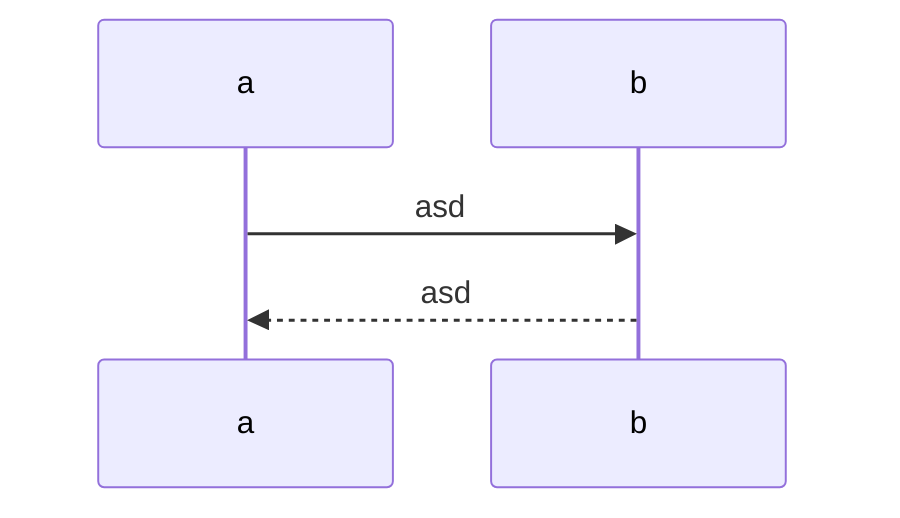
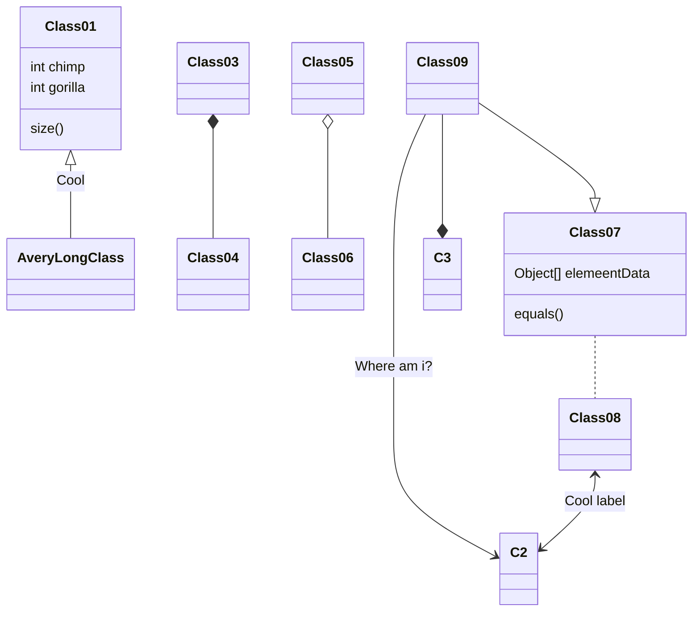

Mermaid是一种基于Javascript的绘图工具

示例：

时序图

```mermaid
sequenceDiagram
a ->> b:asd
b -->> a:asd
```

类图

```mermaid
classDiagram
Class01 <|-- AveryLongClass: Cool
Class03 *-- Class04
Class05 o-- Class06
Class07 .. Class08
Class09 --> C2: Where am i?
Class09 --* C3
Class09 --|> Class07
Class07: equals()
Class07: Object[] elemeentData
Class01: size()
Class01: int chimp
Class01: int gorilla
Class08 <--> C2: Cool label
```

